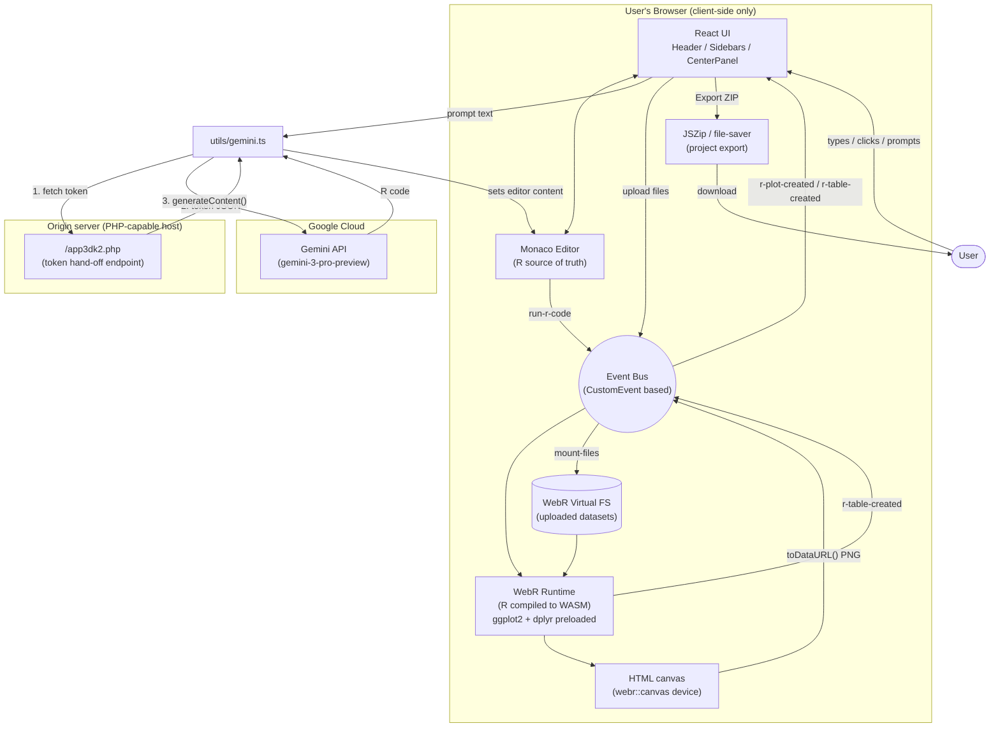
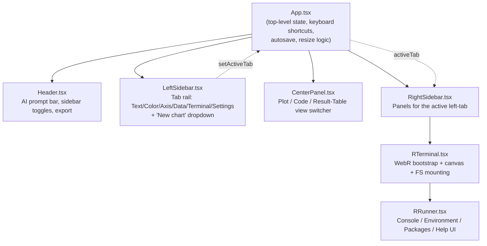
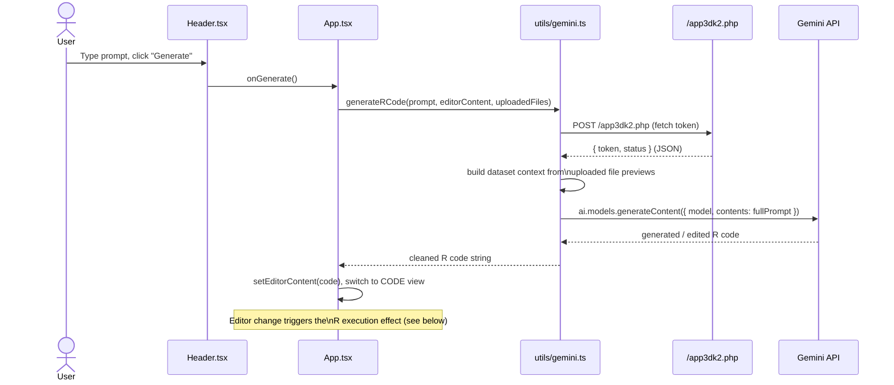
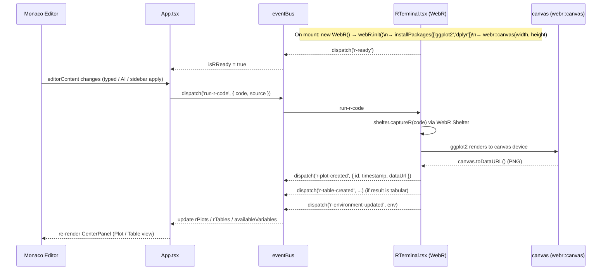
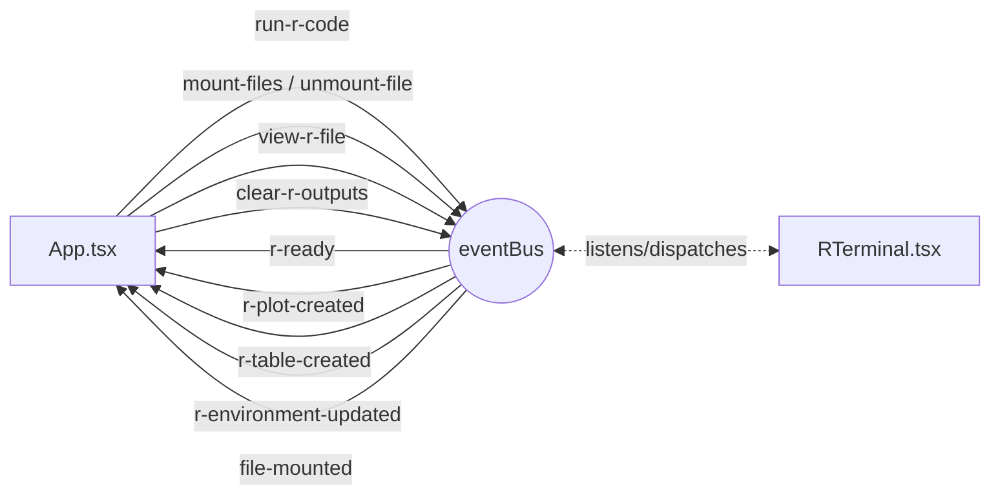
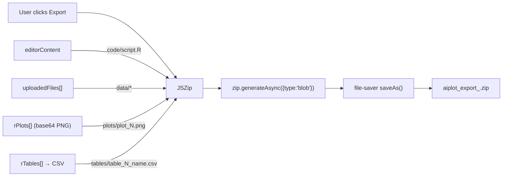
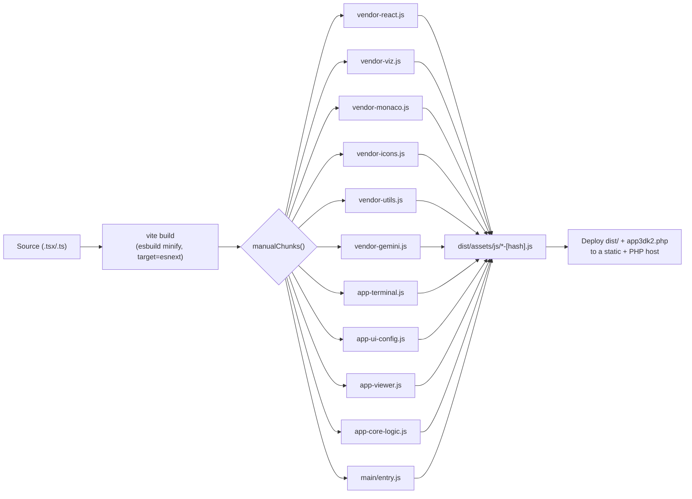

# AIPlot — VPlotTab Editor

**AI‑powered, in‑browser R & ggplot2 data visualization editor.**

AIPlot (internally `aiplot.pharmacometrics.ai_v4`, product name **VPlotTab Editor**) is a single‑page React application that lets a user build publication‑quality `ggplot2` plots entirely in the browser. There is no R server: R itself runs client‑side via **WebR** (R compiled to WebAssembly), and a natural‑language prompt can be turned into runnable R code by **Google Gemini**. The editor combines a Monaco code editor, a live R console/workspace ("RStudio‑style" terminal), a configuration sidebar for labels/theme/axes, and a one‑click project export (R script + data + plots + tables, zipped).

Live site: https://aiplot.pharmacometrics.ai/

---

## Table of contents

- [Key features](#key-features)
- [Architecture](#architecture)
  - [System overview](#system-overview)
  - [Component hierarchy](#component-hierarchy)
  - [AI code generation flow](#ai-code-generation-flow)
  - [R execution flow (WebR)](#r-execution-flow-webr)
  - [Event bus](#event-bus)
  - [Project export flow](#project-export-flow)
- [Tech stack](#tech-stack)
- [Project structure](#project-structure)
- [Prerequisites](#prerequisites)
- [Installation](#installation)
- [Configuring the AI code‑generation backend](#configuring-the-ai-code-generation-backend)
- [Running in development](#running-in-development)
- [Building for production](#building-for-production)
- [Previewing a production build](#previewing-a-production-build)
- [Deploying](#deploying)
- [Keyboard shortcuts](#keyboard-shortcuts)
- [Known issues / things to verify before shipping](#known-issues--things-to-verify-before-shipping)
- [License](#license)

---

## Key features

- **AI plot generation** — describe a chart in plain English in the header bar ("Generate") and Gemini writes (or edits) the `ggplot2` R code for you, aware of any datasets you've uploaded.
- **In‑browser R runtime** — R and `ggplot2`/`dplyr` run fully client‑side through [WebR](https://webr.r-wasm.org/) (R → WebAssembly). No backend R process, no server round‑trip to render a plot.
- **Monaco code editor** — full syntax‑highlighted R editing (`@monaco-editor/react`) with autosave, manual save (`Ctrl/Cmd+S`), and a Plot / Table / Code view switcher.
- **RStudio‑style terminal panel** — a console (with command history), a live **Environment** inspector (objects, classes, data‑frame columns), a **Packages** panel (install additional R packages at runtime via `webR.installPackages`), and a **Help** tab.
- **Visual configuration sidebar** — edit plot **Text** (title/subtitle/axis labels/caption), **Color** (theme, background, grid, palette), **Axis** (map `x`/`y`/`color`/`fill`/`facet` to uploaded columns) and app **Settings**, all of which are read from and written back into the raw R code via regex‑based code manipulation (`utils/codeManipulation.ts`) rather than a separate "spec" — the R script is always the source of truth.
- **Data upload & mounting** — upload CSV/data files from the browser; they're written into WebR's in‑memory filesystem (`FS.writeFile`) at a mount path the generated R code can `read.csv()`/`read.delim()`.
- **One‑click export** — bundles the current R script, uploaded data files, generated plot PNGs, and any result tables (as CSV) into a downloadable `.zip` (via `jszip` + `file-saver`).
- **Responsive / mobile aware** — a dedicated mobile layout with a bottom tab bar and a "desktop recommended" notice for small screens.
- **Resizable, collapsible panels** and app‑wide keyboard shortcuts.

---

## Architecture

### System overview



### Component hierarchy



### AI code generation flow



### R execution flow (WebR)



### Event bus

All cross‑component/runtime communication (`App` ⇄ `RTerminal`/WebR) goes through a tiny `document.dispatchEvent` wrapper (`utils/eventBus.ts`) instead of prop drilling or a state library:



### Project export flow



---

## Tech stack

| Area | Library / tool | Notes |
|---|---|---|
| UI framework | React 18.2 + TypeScript | Function components, hooks only, no external state manager (custom `eventBus` instead) |
| Build tool | Vite 6 | `@vitejs/plugin-react` is **not** currently registered in `vite.config.ts` — see [Known issues](#known-issues--things-to-verify-before-shipping) |
| Styling | Tailwind CSS (via CDN `cdn.tailwindcss.com` in `index.html`) | Not a local PostCSS build — pulled at runtime |
| Code editor | `@monaco-editor/react` | Powers the R "Code" view |
| In‑browser R | [WebR](https://webr.r-wasm.org/) (`https://webr.r-wasm.org/latest/webr.mjs`, loaded directly from the WebR CDN, not npm) | Preloads `ggplot2` + `dplyr`; renders to an HTML `<canvas>` via `webr::canvas()` |
| AI code generation | `@google/genai` (Gemini, model `gemini-3-pro-preview`) | Key is fetched at runtime from `/app3dk2.php`, not bundled |
| Icons | `lucide-react` | |
| Charting (installed, currently unused) | `recharts` | Declared as a dependency / import‑map entry / manual chunk, but no component currently imports it — plots are produced by WebR/ggplot2 onto canvas, not Recharts |
| Export | `jszip`, `file-saver` | Zips script + data + plots + tables for download |
| Module resolution (dev, in `index.html`) | Browser import‑map to `esm.sh` | Lets the app run even before/without a bundled build (`index.html` can be opened as-is against the CDN‑resolved modules); Vite's own bundling is used for the production build |

---

## Project structure

```
v4/
├── App.tsx                     # Top-level app state, layout, keyboard shortcuts, export
├── index.tsx                   # React root mount
├── index.html                  # HTML shell, meta/OG tags, Tailwind CDN, import-map
├── constants.ts                # Default chart config, sample data, palette
├── types.ts                    # Shared TypeScript types (ChartConfig, AppSettings, R types, ...)
├── metadata.json                # App name/description
├── app3dk2.php                 # Server-side token hand-off endpoint for Gemini (see below)
├── vite.config.ts              # Manual chunk-splitting build config
├── tsconfig.json
├── package.json
├── .env.local                  # Local-only env vars (not committed; currently unused by the app code)
├── components/
│   ├── Header.tsx               # AI prompt bar, panel toggles, export button
│   ├── LeftSidebar.tsx          # Tab rail + "new chart" dropdown
│   ├── CenterPanel.tsx          # Plot / Code (Monaco) / Result-Table views
│   ├── RightSidebar.tsx         # Text / Color / Axis / Data / Settings / Terminal panels
│   └── RTerminal/
│       ├── RTerminal.tsx        # WebR bootstrap, canvas, filesystem mounting, eventBus wiring
│       └── RRunner.tsx          # Console / Environment / Packages / Help UI
├── data/
│   └── defaults.ts              # CHART_TYPES, sample datasets, sample R code per chart type
└── utils/
    ├── eventBus.ts               # Tiny CustomEvent pub/sub used across App ↔ RTerminal
    ├── codeManipulation.ts        # Regex-based read/write of labs()/theme()/aes() from R code
    └── gemini.ts                  # Gemini client: token fetch + prompt construction + call
```

---

## Prerequisites

- **Node.js** ≥ 18 (Node 20+ recommended; the dev machine used for this review runs Node 22.x / npm 10.x)
- **npm** (bundled with Node) — a `package-lock.json` is committed, so `npm ci` works
- A modern browser for development (Chrome/Edge/Firefox) — WebR requires WebAssembly + SharedArrayBuffer support, which generally means the app needs to be served with the right cross‑origin isolation headers in production (see [Deploying](#deploying))
- Internet access at runtime: the app loads Tailwind, all its JS dependencies (in dev via `esm.sh`), and WebR itself from CDNs — it is **not** fully offline‑capable as shipped
- A PHP‑capable host (Apache/Nginx + PHP‑FPM, or similar) **if** you want AI code generation to work in production, since the key hand‑off endpoint (`app3dk2.php`) is a PHP script, not a Vite/Node route

## Installation

```bash
# 1. Clone / copy the project, then from the v4/ project root:
cd v4

# 2. Install dependencies (use ci for a byte-for-byte match with package-lock.json)
npm ci
# or: npm install
```

This installs React, Vite, Monaco, the Gemini SDK, JSZip/file-saver, etc. WebR itself is **not** an npm dependency — it's imported directly from `https://webr.r-wasm.org/latest/webr.mjs` at runtime in `components/RTerminal/RTerminal.tsx`, so no local install step is needed for it, but it does mean the browser needs network access to `webr.r-wasm.org` (and R‑Universe/CRAN mirrors it uses) when the app boots.

## Configuring the AI code‑generation backend

The "Generate" button does **not** call Gemini directly from the browser with a bundled key. Instead, `utils/gemini.ts` first calls `POST /app3dk2.php` on the same origin to obtain a token, then uses that token to call the Gemini API. This means:

1. **Local dev**: unless you also run a PHP server alongside Vite (or point the fetch at one), `/app3dk2.php` will 404 and "Generate" will fail with *"Unable to establish secure connection to the reasoning engine."* The rest of the app (editor, WebR console, plotting, export) works without it.
2. **Production**: `app3dk2.php` must be deployed alongside the built static assets on a PHP‑capable host, and must be edited to return a **real** Gemini API key from a server‑side secret (e.g. `getenv('API_KEY')`) instead of the current placeholder string. See [Known issues](#known-issues--things-to-verify-before-shipping) — there is also a field‑name mismatch between what this script returns and what the client currently reads that needs fixing before this will work end‑to‑end.
3. `.env.local` currently defines `GEMINI_API_KEY`, but nothing in the codebase reads it (no `import.meta.env.GEMINI_API_KEY` / `process.env.GEMINI_API_KEY` usage, and `vite.config.ts` has no `define`). If you'd rather bundle a browser‑exposed key directly (simpler, less secure — the key becomes visible to anyone who opens dev tools) instead of the PHP hand‑off, you would need to wire this variable in explicitly.

## Running in development

```bash
npm run dev
```

This starts the Vite dev server (default `http://localhost:5173`) with hot module reload. Open it in the browser and the app will:

1. Mount the React tree,
2. In the background, initialize WebR (downloads the WebR WASM runtime + `ggplot2`/`dplyr` from the WebR CDN — first load can take a several seconds; watch the R console panel for "Initializing WebR..." → "WebR initialized"),
3. Run the sample R code for the default chart once WebR is ready.

## Building for production

```bash
npm run build
```

This runs `vite build`, type‑checking is **not** enforced automatically by this script (there is no `tsc --noEmit &&` step in `package.json`) — run `npx tsc --noEmit` separately if you want a hard type‑check gate in CI.

The build:
- Outputs to `dist/` by Vite's default.
- Uses the custom `manualChunks` strategy in `vite.config.ts` to split the bundle into vendor chunks (`vendor-react`, `vendor-viz`, `vendor-monaco`, `vendor-icons`, `vendor-utils`, `vendor-gemini`) and app chunks (`app-terminal`, `app-ui-config`, `app-viewer`, `app-core-logic`), with assets emitted under `dist/assets/js/`, `dist/assets/<ext>/`.
- Targets `esnext` and minifies with `esbuild`.



## Previewing a production build

```bash
npm run build
npm run preview
```

`vite preview` serves the contents of `dist/` locally (default `http://localhost:4173`) so you can sanity‑check the production bundle before deploying. Note this preview server does **not** serve `app3dk2.php` (it's a static file server), so AI generation will still fail locally unless you proxy it to a real PHP host.

## Deploying

1. Run `npm run build`.
2. Upload the contents of `dist/` **plus** `app3dk2.php` (updated with a real, server‑side‑held Gemini key) to your web host's document root.
3. Ensure the host can execute PHP for `app3dk2.php` (a purely static host such as plain S3/CloudFront or GitHub Pages will not run it — you'd need to reimplement the token hand‑off as, e.g., a small serverless function instead).
4. Because WebR relies on WebAssembly and threading, serve the app over **HTTPS** and confirm cross‑origin isolation (`Cross-Origin-Opener-Policy: same-origin`, `Cross-Origin-Embedder-Policy: require-corp` or `credentialless`) if you see WebR failing to initialize in production — this is a common WebR deployment gotcha and is worth testing explicitly on the chosen host.
5. The app also loads external resources at runtime (Tailwind CDN, WebR CDN, and — outside of the `npm run build` bundle path — `esm.sh` in `index.html`'s import‑map, which Vite's bundler otherwise supersedes for the built output); make sure your production CSP, if any, allows these origins.

## Keyboard shortcuts

| Shortcut | Action |
|---|---|
| `Ctrl/Cmd + S` | Manual save (applies pending editor/sidebar changes and re-runs R) |
| `Ctrl/Cmd + B` | Toggle left sidebar |
| `Ctrl/Cmd + I` | Toggle right sidebar |
| `Alt + P` | Switch center panel to **Plot** view |
| `Alt + T` | Switch center panel to **Result Table** view |
| `Alt + C` | Switch center panel to **Code** view |
| `↑ / ↓` (in R console input) | Cycle through console command history |

## Known issues / things to verify before shipping

These are things worth confirming/fixing during review — none of them block local development of the editor itself, but they will affect production behavior:

- **Token field name mismatch**: `app3dk2.php` returns `{"token": ..., "status": "initialized"}`, but `utils/gemini.ts` reads `payload.kok`. As written, the AI "Generate" feature will always fail in production with *"Handshake payload missing expected 'token' property."* — align the PHP response key with what the client reads (or vice‑versa) before relying on this endpoint.
- **Placeholder secret in `app3dk2.php`**: `$secretToken = "SERVICE_TOKEN_PLACEHOLDER";` needs to be replaced with a real Gemini API key sourced from a server‑side environment variable (the script's own comment suggests `getenv('API_KEY')`), and the endpoint should have session/CSRF protection added, per its own docblock, before going live.
- **`GEMINI_API_KEY` in `.env.local` is currently unused** by any source file — decide whether the app should read it directly (simpler local dev, but exposes the key client‑side) or keep the server‑side hand‑off pattern and drop this variable.
- **`@vitejs/plugin-react` is a devDependency but is not registered as a plugin in `vite.config.ts`** — JSX/Fast Refresh currently works because esbuild handles the default JSX transform, but you likely want the official plugin enabled explicitly for full Fast Refresh support and future-proofing.
- **`recharts` is installed and chunked but not imported anywhere** in the current source — either it's reserved for planned features, or it can be dropped to shrink the dependency graph and the `vendor-viz` chunk.
- **Runtime dependency on multiple third‑party CDNs** (Tailwind Play CDN, WebR CDN, and — in the raw `index.html` import‑map — `esm.sh`) means the app will not function fully offline or behind a restrictive network/CSP without changes.
- **No automated tests or CI configuration** are present in this project as reviewed; `npm run build` does not run a type‑check step by default.

## License

No `LICENSE` file is currently present in this project. Add one (and update this section) before distributing the code publicly.
